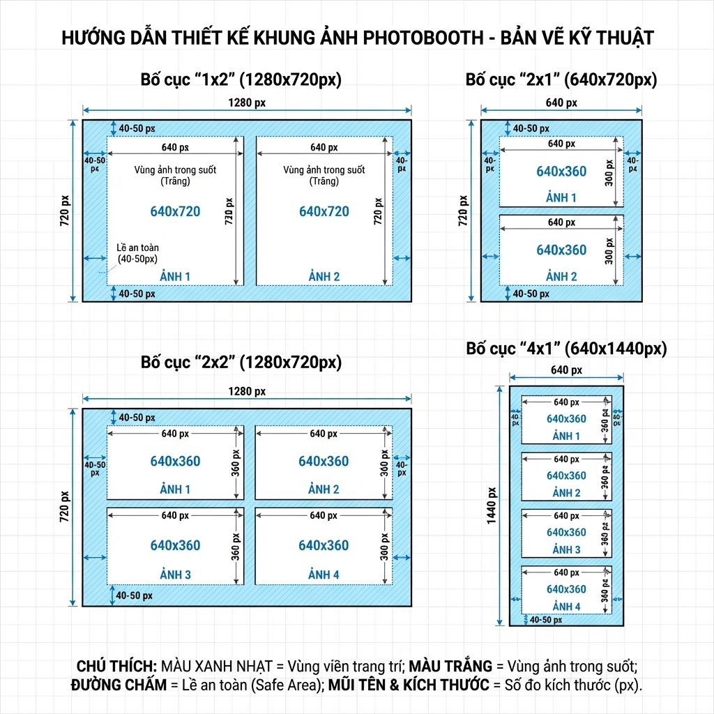
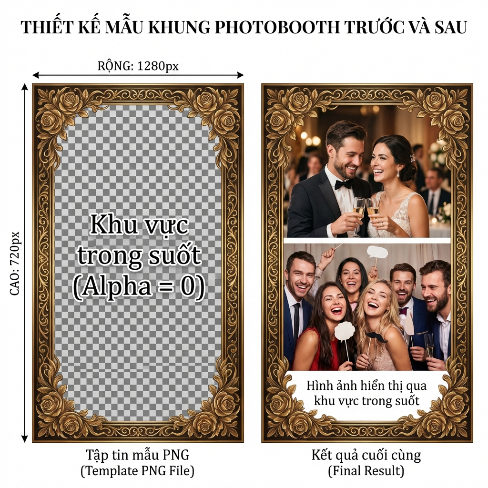

# 📸 HƯỚNG DẪN THIẾT KẾ KHUNG ẢNH PHOTOBOOTH

## 📋 MỤC LỤC
1. [Tổng quan kích thước](#tổng-quan-kích-thước)
2. [Hướng dẫn thiết kế](#hướng-dẫn-thiết-kế)
3. [Công cụ thiết kế](#công-cụ-thiết-kế)
4. [Lưu ý quan trọng](#lưu-ý-quan-trọng)

---

## 📐 TỔNG QUAN KÍCH THƯỚC

### Bảng tra cứu nhanh:

| Layout | File | Kích thước | Tỷ lệ | Số ảnh | Mỗi ảnh |
|--------|------|-----------|-------|--------|---------|
| **1x2** | `2_1x2/*.png` | 1280 x 720 | 16:9 | 2 | 640x720 |
| **2x1** | `2_2x1/*.png` | 640 x 720 | 8:9 | 2 | 640x360 |
| **2x2** | `4_2x2/*.png` | 1280 x 720 | 16:9 | 4 | 640x360 |
| **4x1** | `4_4x1/*.png` | 640 x 1440 | 4:9 | 4 | 640x360 |

### Sơ đồ minh họa:


---

## 🎨 HƯỚNG DẪN THIẾT KẾ

### Bước 1: Chọn công cụ
Bạn có thể dùng:
- **Photoshop** (khuyến nghị)
- **GIMP** (miễn phí)
- **Figma** (online)
- **Canva Pro** (dễ dùng)

### Bước 2: Tạo canvas
```
1. Tạo file mới với kích thước tương ứng layout
2. Chế độ: RGB Color, 8-bit
3. Background: Transparent (trong suốt)
4. Resolution: 72-150 DPI (đủ cho màn hình)
```

### Bước 3: Thiết kế viền
```
1. Vẽ viền trang trí ở 4 cạnh
2. Độ dày viền: 40-60px
3. Để vùng giữa TRONG SUỐT (alpha = 0)
4. Vùng trong suốt = nơi ảnh sẽ hiển thị
```

### Bước 4: Thêm chi tiết
```
- Logo/Text ở góc
- Họa tiết trang trí
- Ngày tháng/Sự kiện
- Lưu ý: Không che khuôn mặt!
```

### Bước 5: Export
```
File → Export → Export As...
- Format: PNG
- ✅ Transparency (bắt buộc!)
- Compression: Medium
- Tên file: ten_khung.png
```

### Ví dụ minh họa:


---

## 🛠️ CÔNG CỤ THIẾT KẾ

### Photoshop
```photoshop
1. File → New
   - Width: 1280px (hoặc 640px)
   - Height: 720px (hoặc 1440px)
   - Background: Transparent
   
2. Vẽ viền:
   - Layer → New → Layer
   - Dùng Rectangle Tool vẽ viền
   - Layer Style → Stroke, Gradient...
   
3. Xóa vùng giữa:
   - Dùng Eraser Tool
   - Hoặc Layer Mask
   
4. Export:
   - File → Export → Export As
   - Format: PNG
   - ✅ Transparency
```

### GIMP (Miễn phí)
```gimp
1. File → New Image
   - Width: 1280, Height: 720
   - Fill with: Transparency
   
2. Vẽ viền:
   - Filters → Render → Gfig
   - Hoặc dùng Paintbrush
   
3. Export:
   - File → Export As
   - Chọn PNG
   - ✅ Save background color: No
```

### Canva Pro
```canva
1. Create design → Custom size
   - 1280 x 720 px
   
2. Thêm elements:
   - Elements → Frames
   - Graphics → Borders
   
3. Download:
   - Download → PNG
   - ✅ Transparent background
```

---

## ⚠️ LƯU Ý QUAN TRỌNG

### ✅ BẮT BUỘC:
1. **File PNG với alpha channel** (không dùng JPG!)
2. **Kích thước chính xác** theo layout
3. **Vùng trong suốt** cho ảnh
4. **Tên file**: chữ thường, không dấu, không khoảng trắng

### ❌ TRÁNH:
1. ❌ Viền quá dày che mất khuôn mặt
2. ❌ Text/Logo ở giữa ảnh
3. ❌ Màu quá sáng/tối gây chói
4. ❌ File JPG (không có alpha channel)

### 💡 TIPS:
- **Safe Area**: Để margin 40-50px từ mép
- **Contrast**: Viền tối cho ảnh sáng, viền sáng cho ảnh tối
- **Test**: Thử với ảnh thật trước khi dùng
- **Backup**: Lưu file PSD/XCF gốc để sửa sau

---

## 📂 CẤU TRÚC THƯ MỤC

```
templates/
├── 2_1x2/              # Layout 1x2 (1280x720)
│   ├── frame_gold.png
│   ├── frame_silver.png
│   └── frame_custom.png
│
├── 2_2x1/              # Layout 2x1 (640x720)
│   ├── frame_gold.png
│   └── ...
│
├── 4_2x2/              # Layout 2x2 (1280x720)
│   ├── frame_gold.png
│   └── ...
│
└── 4_4x1/              # Layout 4x1 (640x1440)
    ├── frame_gold.png
    └── ...
```

### Quy tắc đặt tên:
```
✅ Tốt:
- frame_gold.png
- border_floral.png
- wedding_2024.png

❌ Tránh:
- Khung Vàng.png (có dấu, khoảng trắng)
- Frame 1.png (có khoảng trắng)
- khung.jpg (không phải PNG)
```

---

## 🎯 CHECKLIST TRƯỚC KHI SỬ DỤNG

- [ ] File PNG với alpha channel
- [ ] Kích thước đúng theo layout
- [ ] Vùng giữa trong suốt
- [ ] Viền không che khuôn mặt
- [ ] Đã test với ảnh thật
- [ ] Tên file hợp lệ (không dấu, không khoảng trắng)
- [ ] Đặt đúng thư mục (2_1x2, 2_2x1, 4_2x2, 4_4x1)

---

## 📞 HỖ TRỢ

Nếu gặp vấn đề:
1. Kiểm tra file có alpha channel không (mở bằng Photoshop/GIMP)
2. Xem file mẫu trong thư mục templates/
3. Đảm bảo kích thước chính xác (dùng `python -c "from PIL import Image; print(Image.open('file.png').size)"`)

---

**Chúc bạn thiết kế thành công!** 🎨✨
